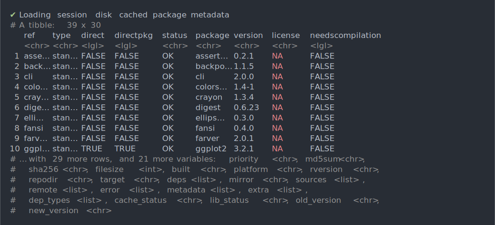
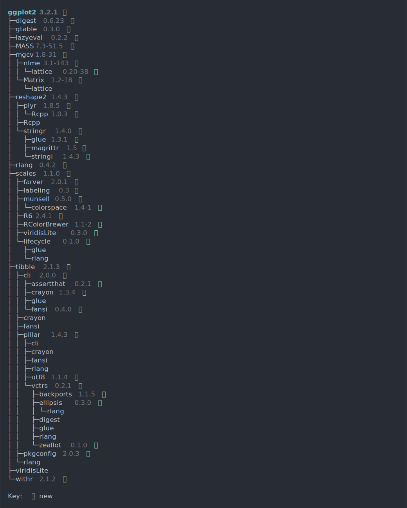
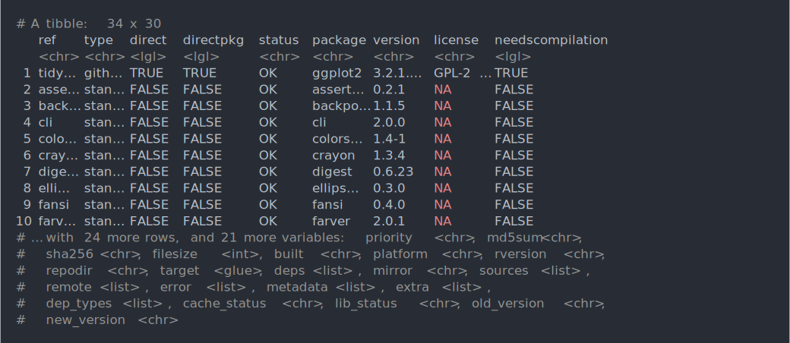
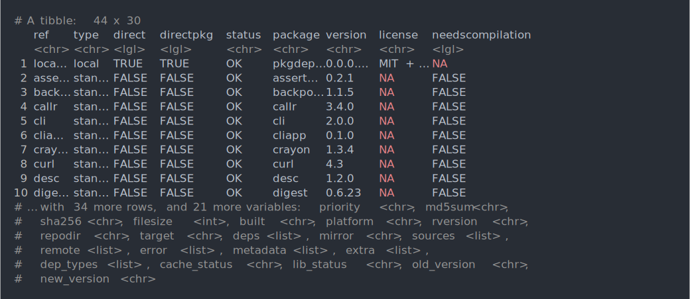
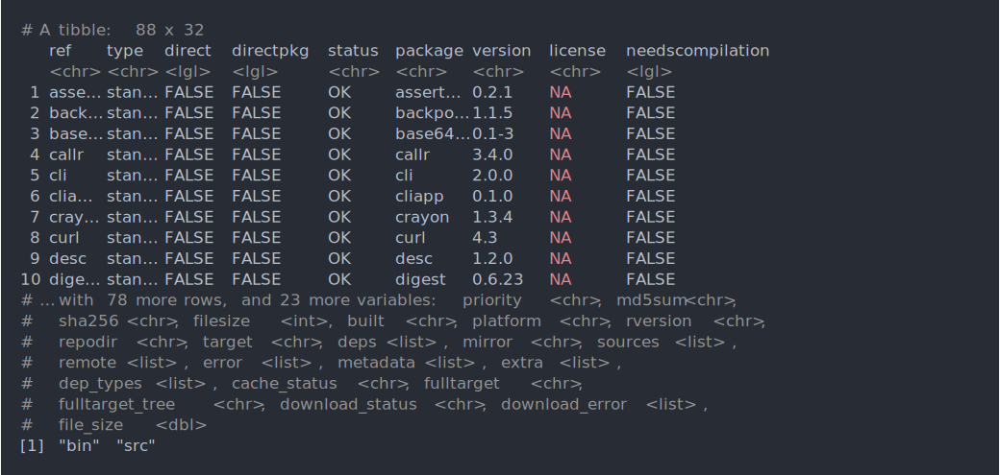
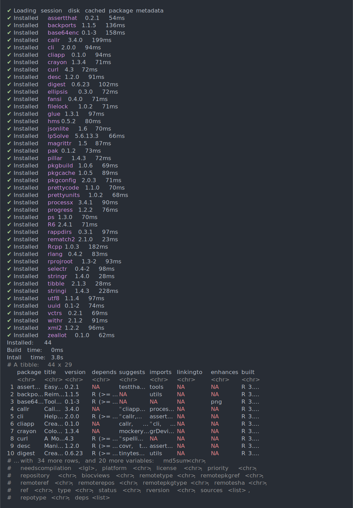
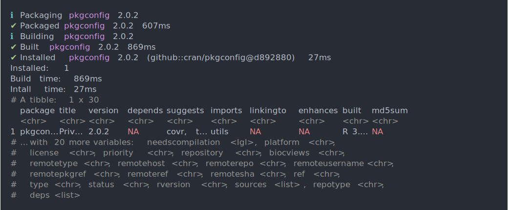
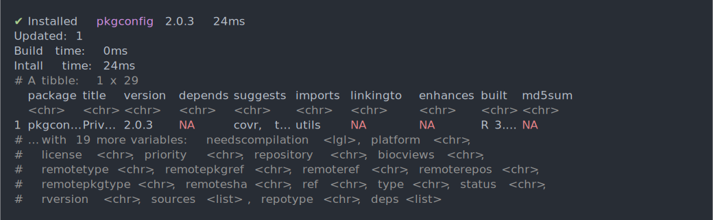

  
# Dependencies

## How to list all dependencies of a CRAN/Bioconductor package?


```asciicast
library(pkgdepends)
prop <- new_pkg_deps("ggplot2")
prop$solve()
prop$get_solution()$data
```




You can also draw a dependency tree:


```asciicast
prop$draw()
```




## How to list all dependencies of a GitHub package?


```asciicast
library(pkgdepends)
prop <- new_pkg_deps("tidyverse/ggplot2")
prop$solve()
prop$get_solution()$data
```




## How to list all dependencies of a local package?


```asciicast
library(pkgdepends)
prop <- new_pkg_deps("local::.")
prop$solve()
prop$get_solution()$data
```




# Downloads

## How to download a package and all of its dependencies?


```asciicast
library(pkgdepends)
target_dir <- tempfile()
dir.create(target_dir)
prop <- new_pkg_download_proposal("ggplot2", config = list(cache_dir = target_dir))
prop$resolve()
prop$download()
prop$get_downloads()
dir(target_dir)
```




# Installation

## How to install a package into a new library?


```asciicast
library(pkgdepends)
dir.create(new_lib <- tempfile())
prop <- new_pkg_installation_proposal("pkgconfig", config = list(library = new_lib))
prop$solve()
prop$download()
prop$install()
lib_status(new_lib)
```




## How to update a package?

Install an older version first.


```asciicast
library(pkgdepends)
dir.create(new_lib <- tempfile())
config <- list(library = new_lib)
prop <- new_pkg_installation_proposal("cran/pkgconfig@2.0.2", config = config)
prop$solve()
prop$download()
prop$install()
lib_status(new_lib)
```




Now update.


```asciicast
library(pkgdepends)
prop2 <- new_pkg_installation_proposal("pkgconfig", config = config)
prop2$set_solve_policy("upgrade")
prop2$solve()
prop2$download()
prop2$install()
lib_status(new_lib)
```



